# Bamcop test

*description of the project*

**Timeframe** 2026-08-25 - 2026-12-01

## Overview

This repository was created via the **Design Assistant**.  
It contains the template files and in-scope pages needed to get started.

GitHub Pages: [https://cra-test-arc.canada.ca/bamcop5-2026](https://cra-test-arc.canada.ca/bamcop5-2026)

---
## Update procedures

Add information on how to manage your repo here.

---
## Design phase roadmap:

- [x] Initial content inventory and repo setup
- [ ] Prototype: co-design navigation and content
- [ ] SME review and accuracy check
- [ ] Validation usability testing (including accessibility review)
- [ ] Refine prototype (if required)
- [ ] Spot check usability (if required)

**Updated:**  2026-09-08

## Information Architecture

```mermaid
flowchart TD;
    node1(Canada.ca)
    node2(Taxes)
    node3(Digital services)
    node4(Digital services for businesses)
    node5(Filing an electronic GST/HST return, rebate or election)
    node6(Electronic rebate forms)
    node7(File public service body rebate forms electronically)
    node8(File form GST523-1 electronically)
    node9(Federal, provincial, and territorial government rebate #40;Form GST490#41;)
    node10(Corporation Internet Filing)
    node11(Are you ready to file your return?)
    node12(Before you start using Corporation Internet Filing)
    node13(About the Corporation Internet Filing service)
    node14(Restrictions)
    node15(Your browser)
    node16(Hours of service)
    node17(Security)
    node18(Software)
    node19(Refunds)
    node20(Help)
    node21(About T2 Auto-fill)
    node22(File)
    node23(Pay)
    node24(View)
    node25(Change)
    node26(Request)
    node27(Email notifications from the CRA – Businesses)
    node28(Payroll Deductions Online Calculator)
    node29(Calculate)
    node30(Automobile Benefits Online Calculator - Disclaimer)
    node31(Register)
    node32(Digital services for individuals)
    node33(Digital services for large corporations and multinational enterprises)
    node34(Digital services for tax preparers)
    node35(Digital services for charities and donors)
    node36(Income tax)
    node37(Tax credits and benefits for individuals)
    node38(GST/HST for businesses)
    node39(Payroll)
    node40(Business registration with the CRA)
    node41(Charities and giving)
    node42(Savings and pension plans)
    node43(Excise and specialty taxes)
    node44(Business registration with the CRA)
    node45(Maintain your business)
    node46(Change of owners, partners, or directors)
    node47(Change a business address)
    node48(Change a business operating name)
    node49(Access to corporate tax information)
    node50(Change of legal status)
    node51(Change of fiscal year-end)
    node52(Change of business activity)
    node53(Buying a business)
    node54(Amalgamation #40;corporations#41;)
    node55(Opening more locations, branches, or divisions)
    node56(Bringing personal assets into your business)
    node57(Temporarily stopping business operations)
    node58(Selling a business)
    node59(Closing CRA program accounts)
    node60(Bankruptcy/receivership)
    node61(Retirement or death of business owner or partner)
    node62(Resume operations)
    node1 --> node2
    node2 --x node3
    node3 --> node4
    node4 --> node5
    node5 --> node6
    node6 --> node7
    node6 --> node8
    node6 --> node9
    node4 --> node10
    node10 --> node11
    node10 --> node12
    node10 --> node13
    node10 --> node14
    node10 --> node15
    node10 --> node16
    node10 --> node17
    node10 --> node18
    node10 --> node19
    node10 --> node20
    node4 --> node21
    node4 --> node22
    node4 --> node23
    node4 --> node24
    node4 --> node25
    node4 --> node26
    node4 --> node27
    node4 --> node28
    node4 --> node29
    node4 --> node30
    node4 --> node31
    node3 --> node32
    node3 --> node33
    node3 --> node34
    node3 --> node35
    node2 --> node36
    node2 --> node37
    node2 --> node38
    node2 --> node39
    node2 --> node40
    node2 --> node41
    node2 --> node42
    node2 --> node43
    node2 --x node44
    node44 --> node45
    node45 --> node46
    node45 --> node47
    node45 --> node48
    node45 --> node49
    node45 --> node50
    node45 --> node51
    node45 --> node52
    node45 --> node53
    node45 --> node54
    node45 --> node55
    node45 --> node56
    node45 --> node57
    node45 --> node58
    node45 --> node59
    node45 --> node60
    node45 --> node61
    node45 --> node62

    classDef inscope stroke:#7636ab,stroke-width:3px
    class node2,node4,node5,node6,node7,node8,node9,node10,node11,node12,node13,node14,node15,node16,node17,node18,node19,node20,node21,node22,node23,node24,node25,node26,node27,node28,node29,node30,node31,node32,node33,node34,node35,node36,node37,node38,node39,node40,node41,node42,node43,node45,node46,node47,node48,node49,node50,node51,node52,node53,node54,node55,node56,node57,node58,node59,node60,node61,node62 inscope
```

